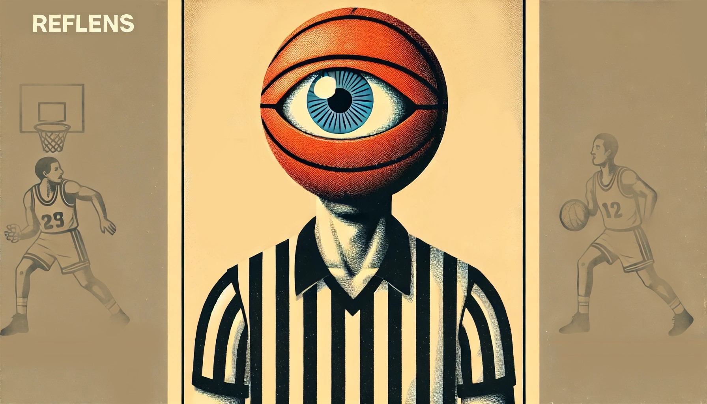

# RefLens

> **Nota:** Per visualizzare questo file in modalità preview, aprilo in un editor di testo come Visual Studio Code, Atom, o un visualizzatore Markdown online come [Dillinger](https://dillinger.io/). Altrimenti, se viene aperto il progetto nel proprio compilatore, come PyCharm, la previw sarà visualizzata automaticamente




RefLens è un programma sviluppato come progetto per il corso universitario di Tecnologie Multimediali. L'obiettivo principale di RefLens è interpretare i segnali ufficiali riconosciuti dalla FIBA (International Basketball Federation) eseguiti dagli Ufficiali di Gioco durante le partite di pallacanestro.

Il progetto è stato concepito inizialmente come supporto per gli Ufficiali di Campo (UdC), per coadiuvare gli arbitri nelle decisioni durante una gara di basket. Successivamente, è stato ampliato per un possibile uso commerciale o televisivo, utile a chiunque voglia comprendere meglio ciò che accade durante una partita di basket, anche senza averne mai vista una prima.

## Requisiti di Sistema

Per un'esecuzione ottimale del programma, si consiglia di utilizzare una macchina con una scheda grafica dedicata e potente. Tuttavia, il programma può funzionare anche su sistemi meno potenti. Le librerie necessarie sono:

- `cv2`
- `pytorch`
- `ultralytics`
- `mediapipe`
- `importlib`
- `os`
- `tkinter`
- `POL`
- `sys`
- `time`
- `math`
- `collections`
- `pydantic`
- `numpy`

### Installazione delle Librerie

È consigliabile installare tutte queste librerie prima dell'esecuzione del programma per evitare errori durante il runtime. Di seguito sono riportati i comandi per installare le librerie tramite `pip`:

```bash
pip install opencv-python
pip install torch
pip install ultralytics
pip install mediapipe
pip install importlib-metadata
pip install python-os
pip install tk
pip install python-polling
pip install sys
pip install time
pip install math
pip install collections
pip install pydantic
pip install numpy
```

Assicurarsi inoltre che la versione CUDA installata sia compatibile con la versione di PyTorch per eseguire il modello YOLO sulla GPU.

## Installazione

Il programma _non_ richiede un'installazione specifica. Per eseguire RefLens, è **sufficiente eseguire il file** `main.py`.

```bash
python main.py
```

## Utilizzo

RefLens interpreta i segnali effettuati durante uno streaming video, sia tramite webcam sia attraverso video già esistenti. I segnali attualmente riconosciuti sono:

+ <u>**Stop the clock (violation)**</u>: alzare il braccio destro e tenere la mano aperta.
+ <u>**Stop the clock for foul**</u>: alzare il braccio destro e tenere la mano chiusa (pugno).
+ <u>**Three points attempt**</u>: alzare il braccio destro e formare un numero tre con le mani (pollice, indice e medio aperti).

Quando un segnale viene riconosciuto, il programma registra un breve video del momento in cui il segnale viene rilevato fino alla sua conclusione. Questi video vengono salvati in _cartelle specifiche_ all'interno della directory **Recording** del progetto.