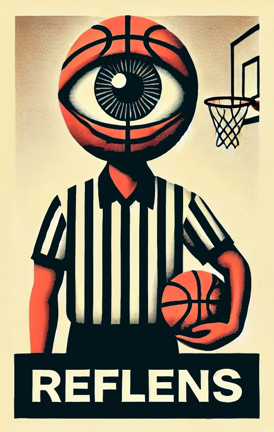

<a id="top"></a>

<div align="center">

  

  # RefLens — FIBA Basketball Referee Signal Detector

  <p align="center">
    
    <a href="https://github.com/ADreLOI/TM-Project-REFLENS/stargazers"></a>
    <a href="https://github.com/ADreLOI/TM-Project-REFLENS/graphs/contributors"></a>
    <a href="https://github.com/ADreLOI/TM-Project-REFLENS/forks"></a>
    <a href="https://github.com/ADreLOI/TM-Project-REFLENS/issues"></a>
    
    
    
  </p>

  <p align="center">
    
    
  </p>

  **An AI-powered real-time computer vision system for recognizing official FIBA referee signals and automatically recording game video highlights.**

</div>

---

<details>
<summary><h2>Table of Contents 📖</h2></summary>

- [About The Project](#about-the-project)
  - [Purpose & Applications](#purpose--applications)
- [Key Features](#key-features)
- [Supported FIBA Signals](#supported-fiba-signals)
- [Project Architecture](#project-architecture)
- [System Requirements & Installation](#system-requirements--installation)
  - [Hardware Requirements](#hardware-requirements)
  - [Installation Steps](#installation-steps)
- [Usage](#usage)
- [Automatic Highlight Recording](#automatic-highlight-recording)
- [Acknowledgments](#acknowledgments)
- [Team](#team)
- [License](#license)

</details>

---

## About The Project

**RefLens** is an advanced Computer Vision application developed as an academic project for the **Tecnologie Multimediali** (Multimedia Technologies) course. 

The primary goal of RefLens is to detect, interpret, and log official **FIBA (International Basketball Federation)** referee signals executed by game officials during basketball matches. 

### Purpose & Applications
- **Table Officials & Referees (UdC Support):** Assist court tables and referees by logging signals in real-time, minimizing human errors during intense match play.
- **Broadcasting & Media:** Provide instant visual pop-ups and notifications for live streams, sports broadcasts, and fan telemetry.
- **Educational Tool:** Help novice fans, commentators, and viewers understand basketball rules and referee calls seamlessly.

---

## Key Features

- **Hybrid AI Architecture:** Combines **YOLOv8-Pose** for body posture/arm tracking with **MediaPipe Hands** for ultra-fine finger gesture recognition.
- **Real-Time & File Stream Processing:** Analyzes live webcam feeds or pre-recorded match video files (`.mp4`, `.avi`, `.mov`, `.mkv`).
- **Dynamic Signal Detection Engine:** Modular, plug-and-play architecture for detecting specific FIBA referee signals.
- **Automated Video Clip Recording:** Automatically captures and exports short `.mp4` video clips into designated directories whenever a signal or foul is recognized.
- **Modern Graphical User Interface:** Built with `tkinter` and `Pillow`, offering dark-mode hover controls, logo headers, and dual input selection.

---

## Supported FIBA Signals

| Signal | Description | Image |
| :--- | :--- | :---: |
| **Stop the clock (Violation)** | Raise right arm vertically with an open hand. |  |
| **Stop the clock for foul** | Raise right arm vertically with a closed fist. |  |
| **Three points attempt** | Raise right arm forming a "3" gesture (thumb, index, middle fingers extended). |  |
| **Communication** | Extend right arm horizontally with a "thumbs up" gesture. |  |
| **Substitution** | Cross forearms in front of the chest to form an "X". |  |
| **Travelling** | Rotate hands/arms horizontally in front of the body. |  |

---

## Project Architecture

```
TM-Vision/
├── Assets/
│   ├── FIBA Signals/          # Reference images for FIBA signals
│   ├── Loghi/                 # Application logos and icons
│   ├── camera.png             # UI webcam button icon
│   └── upload.png             # UI file upload button icon
├── Dynamics/
│   ├── body.py                # YOLOv8 pose keypoints & spatial math logic
│   └── hand.py                # MediaPipe hand landmarks gesture classifier
├── Processing/
│   └── video_processing.py    # Main stream loop, frame renderer & detector pipeline
├── Recording/
│   └── rec.py                 # Automatic foul clip recorder & video exporter
├── signal_detection/          # Dynamic plugin modules for each FIBA signal
│   ├── __init__.py            # Banner overlay renderer with logo
│   ├── communication.py       # Communication gesture detector
│   ├── stop_the_clock.py      # Stop clock violation detector
│   ├── stop_the_clock_foul.py # Stop clock foul detector
│   ├── substitution.py        # Substitution gesture detector
│   ├── three_points_attempt.py# 3-Point attempt detector
│   └── travelling.py          # Travelling rotation detector
├── main.py                    # Graphical User Interface entry point
├── requirements.txt           # Python dependencies manifest
├── yolov8n-pose.pt            # Pre-trained YOLOv8 pose model weights
└── README.md                  # Project documentation
```

---

## System Requirements & Installation

### Hardware Requirements
- **Recommended:** Dedicated GPU with CUDA support for high FPS real-time detection.
- **Minimum:** Any standard multi-core CPU (Webcam stream FPS will depend on CPU throughput).

### Installation Steps

1. **Clone the repository:**
   ```bash
   git clone https://github.com/ADreLOI/TM-Project-REFLENS.git
   cd TM-Project-REFLENS
   ```

2. **Create and activate a virtual environment (recommended):**
   - **Windows:**
     ```bash
     python -m venv venv
     .\venv\Scripts\activate
     ```
   - **Linux / macOS:**
     ```bash
     python3 -m venv venv
     source venv/bin/activate
     ```

3. **Install dependencies:**
   ```bash
   pip install -r requirements.txt
   ```

   > **Note for PyTorch GPU Acceleration:** If you have an NVIDIA GPU, install CUDA-enabled PyTorch by following instructions at [pytorch.org](https://pytorch.org/get-started/locally/).

---

## Usage

Launch the main application interface by executing `main.py`:

```bash
python main.py
```

### Graphical Interface Controls:
1. **Use Webcam:** Starts real-time stream analysis using your connected camera feed (Device index `0`).
2. **Use an Existing Video:** Opens a file dialog to select a pre-recorded match video (`.mp4`, `.avi`, `.mov`).
3. Press **`q`** at any time during stream playback to close the video analysis window.

---

## Automatic Highlight Recording

When a FIBA referee signal is detected, **RefLens** activates its `FoulRecorder` engine:
- Video frames are continually saved in a sliding ring buffer.
- Upon signal confirmation, the program automatically compiles and exports an `.mp4` video file into the `Recording/<signal_name>/` folder.
- Video files are timestamped (e.g., `Recording/communication/communication_1721636400.mp4`).

---

## Acknowledgments

RefLens was developed for the **Multimedia Technologies** course at the University of Trento under the guidance of [**Prof. Francesco G.B. De Natale**](https://disi.unitn.it/~denatale/). We thank him for the course foundations, technical guidance, and feedback that supported the design and realization of the project.

FIBA material is referenced solely as the application domain and source of the official referee-signal vocabulary; no formal collaboration with FIBA is claimed.

---

## Team

| Team member | GitHub | LinkedIn | Email |
| --- | --- | --- | --- |
| Andrea Lo Iacono | [@ADreLOI](https://github.com/ADreLOI) | [LinkedIn](https://www.linkedin.com/in/adreloi) | [andrea.loiacono@studenti.unitn.it](mailto:andrea.loiacono@studenti.unitn.it) |
| Matthew De Marco | [@MattDema](https://github.com/MattDema) | Profile link pending confirmation | [matthew.demarco@studenti.unitn.it](mailto:matthew.demarco@studenti.unitn.it) |

> LinkedIn profile links are included only when confirmed, so the README never directs visitors to the wrong person.

*Università degli Studi di Trento — Course: Tecnologie Multimediali*

---

## License

Distributed under the **GNU General Public License v3.0 (GPL-3.0)**. See [`LICENSE`](./LICENSE) for more information.

<p align="center">
  <a href="#top" style="text-decoration: none;">
    
    <br>
    <strong>Back to Top</strong>
  </a>
</p>
